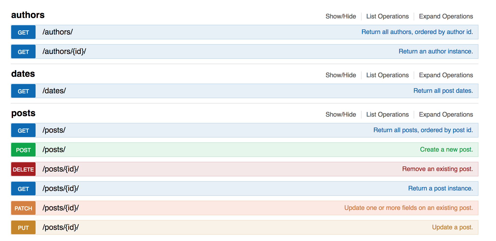

# Journal API Reference
## V1.0


### Models

* Sample post object:
```json
{
        "id": 1,
        "timestamp_posted": "2017-09-14T14:12:10.436420Z", // time of initial posting
        "timestamp_edited": "2017-09-14T14:12:10.436458Z", // time of last edit
        "posted_text": "banter", // text that has been published
        "edited_text": "banter", // 'draft' text
        "author": "brahm",
        "private": false
}
```

* Sample author object:
```json
{
        "id": 1,
        "username": "brahm",
        "email": "brahm@stanford.edu",
        "posts": [
            1
        ]
}
```

